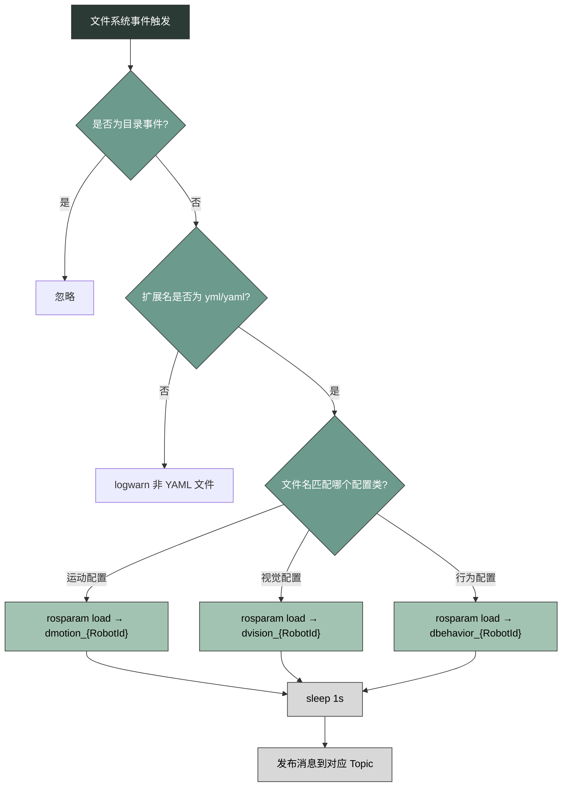
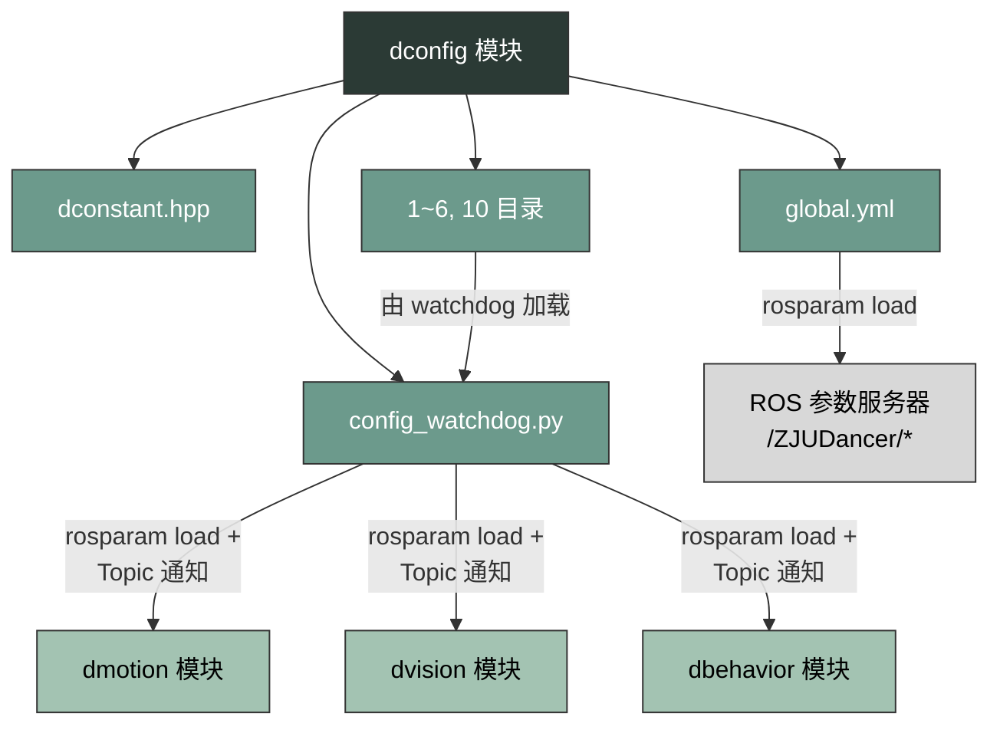

***

# Config Module

---

## 一、概述

`dconfig` 是我们的集中配置仓库，承担两项核心职责：

1. **静态常量定义**：通过 C++ 头文件 `dconstant.hpp` 提供编译期可用的场地几何参数与网络参数。
2. **动态配置热更新**：通过 Python 脚本 `config_watchdog.py` 监听配置文件目录，在 YAML 文件发生变化时自动调用 `rosparam load` 并向对应模块发布通知。

模块的目录结构如下：

```text
dconfig/
├── include/dconfig/
│   └── dconstant.hpp          # 编译期常量（场地几何 + 网络参数）
├── launch/
│   └── dconfig.launch         # 启动 config_watchdog 节点
├── matlab/                    # MATLAB 脚本
├── scripts/
│   └── config_watchdog.py     # 配置热更新守护进程
├── global.yml                 # 全局运行参数
└── 1/ 2/ 3/ 4/ 5/ 6/ 10/     # 各机器人个体配置目录
    ├── dancer_io/             
    ├── dmotion/               
    └── dvision/               
```

---

## 二、静态常量：`dconstant.hpp`

该头文件使用 `#pragma once` 保护，定义了两个命名空间下的编译期 `const` 常量。

### 2.1 场地几何常量 

命名空间为`dconstant::geometry`，所有尺寸单位为厘米（cm）。

| 常量名 | 值 |
|---|---|
| `fieldLength` | 900 |
| `fieldWidth` | 600 |
| `goalDepth` | 60 |
| `goalWidth` | 260 |
| `goalHeight` | 180 |
| `goalAreaLength` | 100 |
| `goalAreaWidth` | 300 |
| `penaltyAreaLength` | 200 |
| `penaltyAreaWidth` | 500 |
| `penaltyMarkDistance` | 150 |
| `centerCircleDiameter` | 150 |
| `borderStripWidth` | 70 |
| `lineWidth` | 5 |
| `ballDiameter` | 13 |
| `robotWidth` | 30 |
| `robotHeight` | 20 |

以下派生常量通过右移位运算（`>> 1`，即除以 2）或加法计算：

| 派生常量名 | 计算来源 |
|---|---|
| `field_length_half` | `fieldLength >> 1` |
| `field_width_half` | `fieldWidth >> 1` |
| `goal_area_width_half` | `goalAreaWidth >> 1` |
| `goal_width_half` | `goalWidth >> 1` |
| `center_circle_radius` | `centerCircleDiameter >> 1` |
| `wholeWidth` | `fieldLength + borderStripWidth * 2` |
| `wholeHeight` | `fieldWidth + borderStripWidth * 2` |

### 2.2 网络常量 
命名空间为`dconstant::network`，包含多个网络相关参数，其中大部分是端口号。
| 常量名 | 值 |
|---|---|
| `NUM_ROBOT` | 6 |
| `robotBroadcastAddressBase` | 48175 |
| `robotCannyBase` | 10329 |
| `robotGuiBase` | 7236 |
| `robotMotionBase` | 13892 |
| `monitorBroadcastAddressBase` | 26333 |
| `TeamInfoBroadcastAddress` | 10017 |
| `NETWORK_FREQ` | 30 |

---

## 三、全局运行参数：`global.yml`

`global.yml` 位于 `dconfig/` 根目录，包含以下配置：

```yaml
ZJUDancer:
    Simulation: false
    OfflineRecord: false
    OfflineReplay: false

    Role: GCDefender

    AttackRight: False
    AlongGrass: False

    UseGameController: True
    GameControllerAddress: 192.168.50.30
    TeamNumber: 17
    TeamCyan: true
    UnicastTargetAddress: 192.168.1.150
    UnicastTargetPort: 10017

    MotionSimdelay: 5000
    udpBroadcastAddress: "255.255.255.255"
    BroadcastMVInfo: False
    VisionOnlyMode: False
```

---

## 四、动态配置热更新：`config_watchdog.py`

### 4.1 节点启动

`dconfig.launch` 以 ROS 节点方式启动 `config_watchdog.py`，并通过环境变量 `ZJUDANCER_ROBOTID` 注入机器人 ID：

```xml
<node pkg="dconfig" name="config_watchdog_node" type="config_watchdog.py"
      output="screen" respawn="false" cwd="node">
    <param name="RobotId" value="$(env ZJUDANCER_ROBOTID)"/>
</node>
```

### 4.2 监听目录与配置分类

节点启动后，读取 `RobotId` 参数，构造监听路径 `../{RobotId}`，并使用 `watchdog` 库的 `Observer` 递归监听该目录下所有文件的变化。

配置文件按所属模块分为三类，每类对应独立的 ROS Topic：

| 配置分类 | 监听文件列表 | 加载命名空间 | 发布 Topic |
|---|---|---|---|
| **运动配置** | `motion.yml`, `motor.yml`, `kick.yml`, `fastkick.yml`, `sidekick.yml`, `setup.yml`, `pvhipY.yml`, `goalie.yml` | `dmotion_{RobotId}` | `/humanoid/ReloadMotionConfig` |
| **视觉配置** | `amcl.yml`, `misc.yml`, `camera.yml`, `localization.yml` | `dvision_{RobotId}` | `/humanoid/ReloadVisionConfig` |
| **行为配置** | `move.yml` | `dbehavior_{RobotId}` | `/humanoid/ReloadBehaviorConfig` |

### 4.3 热更新流程

当 `watchdog` 检测到文件修改事件（`on_modified`）时，执行以下流程：



---

## 五、机器人个体配置目录结构

每个机器人（ID 为 1、2、3、4、5、6、10）拥有独立的配置目录，结构基本相同。以 ID=1 为例：

```text
1/
├── dancer_io/          
│   ├── fastkick.yml
│   ├── goalie.yml
│   ├── kick.yml
│   ├── motion.yml
│   ├── motor.yml
│   ├── pvhipY.yml
│   ├── setup.yml
│   └── sidekick.yml
├── dmotion/            
│   ├── parameters/
│   │   └── motion_hub_param.yaml   
│   ├── walk_param/
│   │   └── foot_z.yml              
│   ├── climb_param/
│   │   ├── back_climb.txt          
│   │   └── forward_climb.txt       
│   ├── ankle_pitch_param.yml       
│   ├── ankle_roll_param.yml        
│   ├── ankle_x_param.yml           
│   ├── ankle_y_param.yml           
│   ├── ankle_yaw_param.yml         
│   ├── ankle_z_param.yml           
│   ├── com_x_param.yml             
│   ├── com_y_param.yml             
│   ├── com_z_param.yml             
│   ├── fastkick.yml
│   ├── goalie.yml
│   ├── kick.yml
│   ├── motion.yml
│   ├── motor.yml
│   ├── pvhipY.yml
│   ├── setup.yml
│   └── sidekick.yml
└── dvision/            
    ├── camera.yml      
    ├── localization.yml 
    └── misc.yml        
```

### 5.1 运动动作参数

囊括在`dancer_io/` 与 `dmotion/` 目录下，其中动作参数文件均以 `dmotion:` 为根键。

#### `motor.yml`

代表电机硬件的映射，定义 18 个舵机的 ID、初始角度、方向符号、分辨率及关节名称。

```yaml
dmotion:
    motor:
      num: 18
      id:   [1, 2, 3, 4, 5, 6, 7, 8, 9, 10, 11, 12, 13, 14, 16, 18, 21, 22]
      init: [180, 157.5, 169.5, ...]   
      zf:   [1, -1, -1, ...]           
      k:    [4096, 4096, ...]          
      lb/ub:                           
      name: ["right_arm_upper", "right_hip_pitch", ...]
```

> 发现：`motor.yml` 在 `dancer_io/` 与 `dmotion/` 根目录下均存在，且两者的 `init` 和 `zf` 数组存在差异。
> 发现：`dconfig/1/dmotion/motor.yml` 有未提交的更改（包含 Git 冲突标记）。

#### `kick.yml` / `fastkick.yml` / `sidekick.yml` 

每个文件定义左右脚的踢球参数，格式统一：

```yaml
dmotion:
    leftKick:          # 或 leftFastKick / leftSideKick
        data: [...]    
        row: 17        
        hip: -52       
        knee: -55      
        ankle: -58     
        ratio: 0.5     
        debug: false
```

`data` 数组按 `row` 行展开，每列包含 17 个对应的参数。

#### `pvhipY.yml`

存储 5 组（`row: 5`）数据，每组 56 个采样点。

#### `goalie.yml` 

定义守门员扑救动作的矩阵（`row: 11`）。

#### `setup.yml` 

定义 `frontDown`（前倒起身）和 `backDown`（后倒起身）两组动作的矩阵（`row: 10`）。

### 5.2 步态核心参数

存放在`dmotion/parameters/motion_hub_param.yaml`文件中，包含步态系统的数值参数：

| 参数组 | 关键参数 |
|---|---|
| `OneFootLanding` | `upper_leg_length: 12.3`, `lower_leg_length: 13.0`, `half_hip_width: 4.5` |
| `PendulumWalk` | `tao: 0.33`, `tick_num: 33`, `com_h: 37.0`, `y_half_amplitude: 3.0` |
| `PendulumWalk` | `max_step_x: 11.0`, `max_step_y_out: 4.0`, `max_step_yaw: 25.0` |
| `Climb` | `whole_time: 0.5`, `not_leg_only_number: 17` |
| `Kick` | `right_kick_x: -15.0`, `right_kick_y: 14.0` |
| `Status` | `adjust_max_x: 4`, `adjust_max_y: 2.5`, `adjust_max_yaw: 10` |
| `Status` | `stop_walk_dis: 30`, `one_step_y_out: 4.5` |

### 5.3 关节轨迹参数
* **文件路径**: `dmotion/` 目录（如 `ankle_*_param.yml`、`com_*_param.yml` 等）
* **存储内容**: 各关节轴向的数据
* **格式**: 统一为 `data: [...]` 数组

### 5.4 攀爬轨迹数据
* **文件路径**: `dmotion/climb_param/` 目录
* **包含文件**: `back_climb.txt`、`forward_climb.txt`
* **格式**: 以空格分隔的数值矩阵

### 5.5 视觉参数
* **文件名**: `camera.yml`
* **文件路径**: `dvision/` 目录
* **存储内容**: 相机硬件配置与标定参数

```yaml
dvision:
  camera:                        
    device: /dev/Camera
    width: 1280 / height: 720
    exposure_absolute: 150
    whitebalance_absolute: 3730

  projection:                    
    fx: 773.5550 / fy: 773.2200
    cx: 640.9000 / cy: 351.4925
    dist_coeff: [...]            # 14 个畸变系数

    extrinsic_para: [...]        # 16 个外参
```

#### `misc.yml` — 场地模型参数

```yaml
dvision:
  field_model:
    field_length: 900 / field_width: 600
    goal_width: 260 / goal_height: 180
    penalty_mark_distance: 210   
    center_circle_diameter: 150
    ball_diameter: 15
```

> 发现：`misc.yml` 中的 `penalty_mark_distance` 为 **210**，而 `dconstant.hpp` 中对应常量为 **150**，两者存在差异。

#### `localization.yml` — 定位算法参数

```yaml
dvision:
  object_detector:
    input_model_file: '/home/nvidia/robocup_ws/core/src/dvision/vision_model/exported_model/model.engine'
    input_names_file: '/home/nvidia/robocup_ws/core/src/dvision/vision_model/exported_model/hum.names'
  field_detector:
    h0: 30 / h1: 108 / s0: 113 / v0: 22   
  line_detector:
    h0: 20 / h1: 77 / s0: 25 / v0: 64     
```

---

## 六、MATLAB 脚本（`matlab/`）

`matlab/` 目录包含以下文件：

| 文件名 |
|---|
| `calc_error.m` |
| `calc_extrinsic.m` |
| `calc_xy.m` |
| `dtranslate.m` |
| `errorfunc.m` |
| `main.m` |
| `projection.m` |
| `rotateX.m` / `rotateY.m` / `rotateZ.m` |
| `test.m` |
| `transform.m` |

---

## 七、模块间依赖关系

