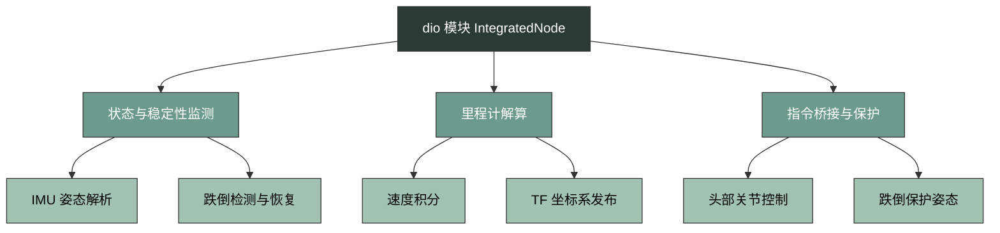
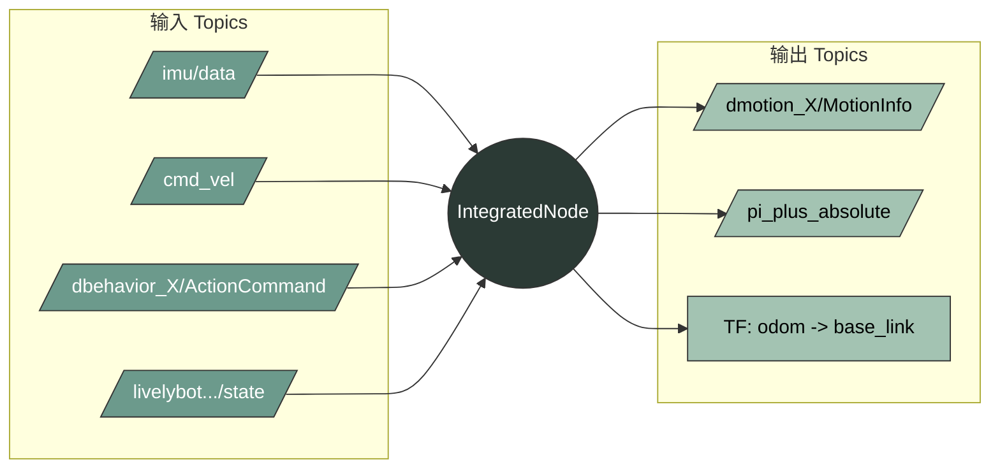

***

# IO Module (dio)

## 概述

`dio` (dancer-io) 是一个以 ROS 节点 (`IntegratedNode`) 运行的状态汇聚与指令转换模块。它负责监听机器人的传感器数据与运动指令，在内部进行里程计解算和稳定性评估，并向外发布综合运动状态（`MotionInfo`）和关节控制指令（`JointState`）。

整个模块的运转流程如下：
1. **状态感知**：读取 IMU 数据和头部电机的当前位置与速度。
2. **稳定性评估**：根据 IMU 的 Roll/Pitch 角度判断机器人是否稳定，并记录前倾或后倾状态。
3. **里程计解算**：结合 `/cmd_vel` 的线速度与 IMU 的偏航角（Yaw），计算机器人在平面内的相对坐标。
4. **指令桥接与保护**：接收行为模块下发的头部动作指令，在机器人稳定时进行角度单位转换并透传；在失稳时强制输出固定的保护姿态角度。
5. **状态广播**：将综合状态打包为 `MotionInfo` 并发布，同时广播里程计 TF 变换。

---

## 核心功能架构

`dio` 模块的内部逻辑主要分为三个核心子系统：状态与稳定性监测、里程计解算、指令桥接与保护。

### 1. 状态与稳定性监测 
该部分`checkStability`通过订阅 `/imu/data` 提取欧拉角（Roll, Pitch, Yaw）。
- **跌倒检测**：当 Roll 或 Pitch 的绝对值超过设定的阈值（`angle_threshold_`，默认 0.5），且连续超过指定次数（`stable_threshold_`，默认 2 次）时，系统判定机器人失稳（`stable_ = false`）。
- **跌倒方向识别**：当判定失稳时，通过判断 Pitch 是否大于 `angle_threshold_` 或小于 `-angle_threshold_`，识别机器人是前倾还是后倾，并记录在 `motion_info_.forward_or_backward` 中。
- **自动恢复**：当姿态恢复到阈值以内，且持续时间超过恢复超时设定（`re_stable_timeout_`，默认 5 秒）后，系统将 `stable_` 重新置为 `true`。

### 2. 里程计解算 

在机器人处于稳定状态（`stable_ == true`）时，模块会更新里程计。

- **偏航角处理**`processYawForOdom`：记录接收到的第一个 IMU Yaw 角作为零点，并处理角度的环绕（Unwrap），计算出相对偏航角 `theta_rel_`。
- **速度积分**`updateOdom`：订阅 `/cmd_vel` 获取线速度 $$v_x$$ 和 $$v_y$$。代码中虽然声明了平均速度变量，但实际积分计算直接使用了当前速度，公式如下：

$$
\dot{x} = v_x \cos(\theta_{rel} + \frac{\pi}{2}) - v_y \sin(\theta_{rel} + \frac{\pi}{2})
$$

$$
\dot{y} = v_x \sin(\theta_{rel} + \frac{\pi}{2}) + v_y \cos(\theta_{rel} + \frac{\pi}{2})
$$

$$
x_{new} = x_{old} + \dot{x} \cdot \Delta t
$$

$$
y_{new} = y_{old} + \dot{y} \cdot \Delta t
$$

- **TF 发布**`publishTF`：将计算得到的 $$x$$、$$y$$ 和 $$\theta_{rel}$$ 作为 `odom_frame` 到 `base_frame` 的 Transform 广播出去（受 `publish_tf_` 参数控制）。

### 3. 指令桥接与保护 
该部分负责处理高层下发的动作指令`/dbehavior_X/ActionCommand`，主要实现函数为`actionCallback`。
- **指令拦截**：如果传入的头部 Pitch 速度绝对值小于 0.1，回调函数会直接返回，不发布任何指令。
- **正常透传**：当机器人稳定`stable_ == true`时，将行为模块要求的头部 Pitch 和 Yaw 角度从度转换为弧度，打包成 `sensor_msgs::JointState` 发布。
- **跌倒保护**：当检测到机器人失稳时，模块会忽略传入的角度指令，强制输出固定的保护姿态：前倾（`forward_or_backward == true`）时头部 Pitch 设为 -1.2 弧度，后倾时设为 0.5 弧度；Yaw 均设为 0。

---

## ROS 接口与数据流

### 订阅的话题 
| 话题名称 | 消息类型 | 用途说明 |
|---|---|---|
| `/imu/data` | `sensor_msgs::Imu` | 获取姿态四元数，用于稳定性检测和里程计 Yaw 轴计算。 |
| `/cmd_vel` | `geometry_msgs::Twist` | 获取线速度 $$v_x$$ 和 $$v_y$$，用于里程计积分。 |
| `/dbehavior_{RobotId}/ActionCommand` | `dmsgs::ActionCommand` | 接收头部 Pitch/Yaw 的角度和速度指令。 |
| `/livelybot_real_real/Head_Pitch_controller/state` | `dmsgs::MotorState` | 读取头部 Pitch 电机的当前位置和速度。 |
| `/livelybot_real_real/Head_Yaw_controller/state` | `dmsgs::MotorState` | 读取头部 Yaw 电机的当前位置和速度。 |

### 发布的数据 
| 目标 / 话题名称 | 数据类型 | 用途说明 |
|---|---|---|
| `/dmotion_{RobotId}/MotionInfo` | `dmsgs::MotionInfo` | 综合状态输出。包含：稳定性标志、IMU 欧拉角（单位：度）、当前头部姿态（单位：度）、机器人运动状态（$$v_x$$ 或 $$v_y$$ 绝对值大于 0.1 时为 1 (WALKING)，否则为 0 (STANDBY)）。**注意：输出的里程计坐标 x 乘了 30 倍，y 乘了 40 倍。** |
| `/pi_plus_absolute` | `sensor_msgs::JointState` | 包含 `head_pitch_joint` 和 `head_yaw_joint` 的绝对位置控制指令。 |
| *通过 `tf2_ros::TransformBroadcaster` 广播* | `geometry_msgs::TransformStamped` | 广播 `odom_frame` 到 `base_frame` 的坐标系变换。 |

---

## 配置与参数

`dio` 模块的参数在节点初始化时通过私有句柄 `~` 读取。核心参数如下：

| 参数名 | 类型 | 默认值 | 说明 |
|---|---|---|---|
| `RobotId` | `int` | *无默认值* | 机器人 ID，通过环境变量 `ZJUDANCER_ROBOTID` 传入 launch 文件获取。若未获取到则抛出异常。 |
| `~odom_frame` | `string` | `"odom"` | 里程计坐标系的名称。 |
| `~base_frame` | `string` | `"base_link"` | 机器人基座坐标系的名称。 |
| `~publish_tf` | `bool` | `true` | 是否发布 TF 变换。 |
| `~stable_threshold` | `int` | `2` | 判定为失稳所需的连续超限次数。 |
| `~angle_threshold` | `double` | `0.5` | 判定失稳的 Roll/Pitch 角度绝对值阈值。 |
| `~re_stable_timeout` | `double` | `5.0` | 姿态恢复正常后，重新判定为稳定状态所需的等待时间（秒）。 |