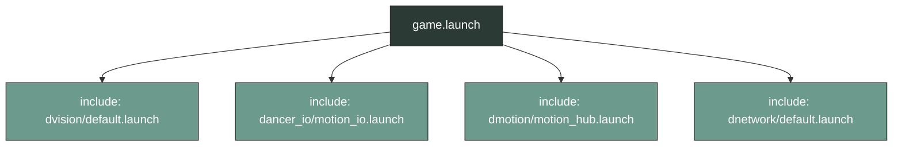
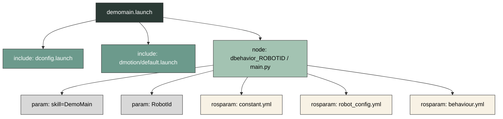

***

# Launch Module

## 概述
`dlaunch` 模块通过一系列 `.launch` 文件，将 `dvision`、`dmotion`、`dbehavior`、`dnetwork`、`dancer_io` 等子系统进行组合。从代码实现来看，该模块依赖 ROS 原生的 `<include>`、`<node>`、`<param>`、`<rosparam>` 以及 `<env>` 标签来组织节点启动与参数加载逻辑。

---

## 核心启动文件

根据文件内部的标签结构与包含关系，可将这些启动文件划分为以下几类：

### 1. 纯模块组合 (`<include>` 主导)
这类文件主要通过 `<include>` 标签加载其他包的启动文件，不显式声明具体的节点（`<node>`）参数：
- **`game.launch`**：包含 `dvision/launch/default.launch`、`dancer_io/launch/motion_io.launch`（`game.launch`中有引用，但robocup_ws中未直接包含）、`dmotion/launch/motion_hub.launch` （类似的，未直接包含源文件）以及 `dnetwork/launch/default.launch`。
- **`piplus.launch`**：包含 `dvision/launch/zed_default.launch`、`dio/launch/dancer-io.launch`、`dplanner/launch/default.launch`、`dnetwork/launch/default.launch` 以及 `dbehavior/launch/default.launch`。
- **`mv.launch`**：包含 `dconfig/dconfig.launch`、`dvision/launch/default.launch` 和 `dmotion/launch/default.launch`。
- **`sim_default.launch`**：包含 `dvision/launch/default.launch`、`dmotion/launch/default.launch`、`dnetwork/launch/default.launch`，并设置参数 `/ZJUDancer/Simulation` 为 `true`。
- **`get_image_180.launch`**：包含 `dconfig/launch/default.launch`、`dmotion/launch/default.launch`、`dvision/launch/default.launch`、`dnetwork/launch/default.launch`，并加载 `global.yml`。

### 2. 仿真实例与集群编排
通过参数服务器注入 `<param name="/ZJUDancer/Simulation" value="true"/>`，并组合特定编号的文件：
- **单体实例 (`sim_1.launch` - `sim_6.launch`)**：分别包含 `dvision`、`dmotion` 和 `dnetwork` 目录下对应编号（1-6）的 `.launch` 文件，同时设置 `/ZJUDancer/BroadcastMVInfo` 为 `true`。
- **集群组合 (`2.launch`, `3.launch`, `4.launch`)**：通过嵌套包含多个 `sim_X.launch` 文件来实现组合。例如 `4.launch` 内部直接包含了 `sim_1.launch` 到 `sim_4.launch`。

### 3. 数据录制与回放 (`rosbag`)
利用 `rosbag` 节点处理数据流，并通过参数标记状态：
- **`record.launch`**：包含 `dvision/launch/default.launch`、`dconfig/launch/dconfig.launch`、`dnetwork/launch/default.launch`、`dmotion/launch/motion_hub.launch` 和 `dancer-io/launch/motion_io.launch`。启动 `rosbag record` 节点，参数为 `-O $(env HOME)/test.bag dvision_$(env ZJUDANCER_ROBOTID)/cam_image /dmotion_$(env ZJUDANCER_ROBOTID)/MotionInfo`。设置参数 `OfflineRecord` 为 `true`，`OfflineReplay` 为 `false`。
- **`replay.launch`**：包含 `dvision/launch/default.launch`、`dnetwork/launch/default.launch`。启动 `rosbag play` 节点，参数为 `$(env HOME)/test.bag`。设置参数 `OfflineRecord` 为 `false`，`OfflineReplay` 为 `true`。

### 4. 节点参数与配置注入 (`<node>` 与 `dbehavior`)
这些启动文件（.launch）的作用是运行特定的程序模块（节点），并根据当前机器人的编号和环境自动加载对应的设置
- **`demomain.launch`**：启动并配置 `dbehavior` 的 `main.py` 节点，传入参数 `skill="DemoMain"` 和 `RobotId=$(env ZJUDANCER_ROBOTID)`，并根据 `ZJUDANCER_ROBOTID` 环境变量加载对应的 `constant.yml`、`robot_config.yml` 和 `behaviour.yml`。
- **`get_image.launch`**：启动并配置 `dbehavior` 的 `main.py` 节点，传入参数 `role="GetImage"`，并加载相关 YAML 配置。
- **`get_ext_data.launch`**：包含 `dancer-io.launch`，启动并配置 `dbehavior` 节点，传入参数 `role="GetImage"`。
- **`get_image_behavior.launch`**：启动并配置 `dbehavior` 节点，传入参数 `role="GetImage180"`。
- **`joy.launch`**：启动并配置 `joy_node`，同时拉起 `dbehavior` 节点并传入参数 `skill="SmartDoll"`。
- **`fake.launch`**：包含 `dvision/launch/default.launch`、`dmotion/launch/default.launch`，启动并配置 `joy_node`节点。
- **`dviz.launch`**：启动并配置 `dviz_node` 节点，传入参数 `RobotId="0"`。
- **`debug.launch`**：包含 `dconfig/launch/default.launch`、`dbehavior/launch/default.launch`。

---

## 进程控制与环境变量依赖

### 环境变量的绑定 (`ZJUDANCER_ROBOTID`)
该环境变量在多个文件中被调用，主要用于：
1. **节点命名空间区分**：如 `<node name="dbehavior_$(env ZJUDANCER_ROBOTID)">` 或 `<node name="dviz_$(env ZJUDANCER_ROBOTID)">`。
2. **配置路由寻址**：在加载 YAML 文件时动态构建路径，如 `$(find dconfig)/$(env ZJUDANCER_ROBOTID)/dbehaviour/robot_config.yml`。
3. **话题名称拼接**：在 `record.launch` 中用于拼接 `rosbag` 订阅的话题名，如 `dvision_$(env ZJUDANCER_ROBOTID)/cam_image`。

### 节点生命周期与日志属性
在大部分声明 `<node>` 的文件中（如 `demomain.launch`, `dviz.launch`, `fake.launch` 等）：
- 均配置了 **`respawn="false"`** 和 **`output="screen"`** 属性。
- 在 `debug.launch` 和 `dviz.launch` 中，通过 `<env name="ROSCONSOLE_CONFIG_FILE" value="$(find dlaunch)/drosconsole.conf"/>` 设置了特定的日志配置文件路径。

---

## 典型启动拓扑结构

以下拓扑图展示了 `dlaunch` 中两种组合逻辑的实际代码层级关系。

### 结构一：纯 `<include>` 组合 (`game.launch`)

| **特征** | 仅通过 `<include>` 标签加载其他包的 `.launch` 文件，无 `<node>` 声明。 |
| :--- | :--- |

### 结构二：节点与参数注入 (`demomain.launch`)

| **特征** | 结合环境变量 `ZJUDANCER_ROBOTID`，为 `<node>` 注入 `<param>` 与 `<rosparam>`。 |
| :--- | :--- |

