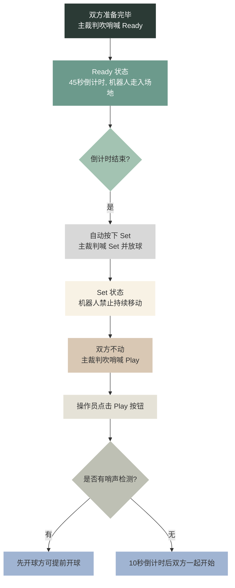
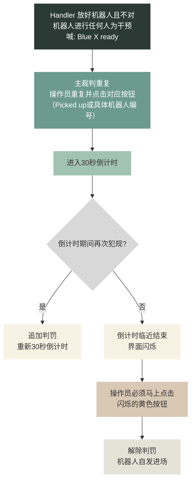

---

# 裁判盒


## 1. 安装 Node.js
1. 下载安装包：[https://nodejs.org/zh-cn/download](https://nodejs.org/zh-cn/download)。
2. 运行安装包，手动勾选“Add to PATH”。
3. 检查安装：

**Windows CMD / Windows Powershell / Ubuntu Bash**
```bash
node -v
npm -v
```

## 2. 安装 Rust
1. 访问 [https://www.rust-lang.org/tools/install](https://www.rust-lang.org/tools/install) 下载并运行 rustup-init。
2. 按提示默认安装（直接回车）。若提示缺少 C++ 编译工具，请按引导安装 Visual Studio Build Tools。
3. 检查安装：

**Windows CMD / Windows Powershell / Ubuntu Bash**
```bash
rustc -V
```

## 3. 安装裁判盒
1. 安装 libclang (用于 bindgen)：

**Windows CMD**
```cmd
winget install LLVM
set LIBCLANG_PATH=C:\Program Files\LLVM\bin\
```

**Windows Powershell**
```powershell
winget install LLVM
$env:LIBCLANG_PATH="C:\Program Files\LLVM\bin\"
```

**Ubuntu Bash**
```bash
sudo apt-get update
sudo apt-get install llvm libclang-dev
```

2. 克隆代码并编译：

**Windows CMD / Windows Powershell**
```cmd
git clone https://github.com/RoboCup-HumanoidSoccerLeague/GameController.git
cd GameController\frontend
npm ci
npm run build
cd ..
cargo build -r
```

**Ubuntu Bash**
```bash
git clone https://github.com/RoboCup-HumanoidSoccerLeague/GameController.git
cd GameController/frontend
npm ci
npm run build
cd ..
cargo build -r
```

## 4. 启动裁判盒

**Windows CMD / Windows Powershell / Ubuntu Bash**
```bash
cargo run
```

## 5. 比赛基本信息设置
在比赛开始前，需要在裁判盒的 **Initial 界面** 进行基本信息设置：
- **比赛分组与模式**：分为 Small、Middle 和 Large。包含 Foundation 和 Advanced 模式。
  - Small: Foundation (4v4), Advanced (7v7)
  - Middle/Large: Foundation (3v3), Advanced (5v5)
  - *注意：*双方同意才可使用 Advanced 模式允许多个机器人上场；若一方数量不足或要求，则必须按 Foundation 模式（例如双方各4台）。
- **队伍与颜色**：选择双方队伍信息及球衣颜色。双方颜色不得重复（同队守门员与其他球员颜色可相同）。
- **场地对应**：勾选按键可交换左右侧显示，以便在场地上和具体队伍所在区域相对应（例如 Berlin United 在场地的右侧，进攻场地的左侧）。
- **网络与显示**：可选择全屏模式。**必须选择电脑的无线网口**作为监听消息的网口，否则无法与机器人通信。
- **高级设置**：Testing 和 Casting 无需使用。设置完成后点击 `Start`。

> 截图提示：此处可插入 **1.png**（比赛基本信息设置界面）

## 6. 赛前准备与替换
进入主界面后，左右两端为队伍设置，中间为判罚与比赛进程控制按钮。
- **修正编号与颜色**：确认上场机器人编号与球衣颜色。如需调整，点击 `Substitute` 按钮，选择要替换的机器人（例如将1号替换为5号作为守门员，或3号换6号）。替换后球衣颜色保持一致。当替换守门员时，需要特别注意，颜色不得与其他球员的颜色相混淆。
- **Timeout（暂停准备）**：上下半场前的任意一个等待时间可点击 `Timeout` 增加5分钟准备时间。每队整场各有1次机会，双方可累积至10分钟。若双方都在上半场开始之前用掉了Timeout，在中场休息时双方就不能再延长休息的时间了。
- **赛前 Picked up**：比赛开始时不准备上场的机器人，需提前进行 `Picked up` 处理（例如右方2号），确保开场时上场机器人不处于该状态。

> 截图提示：此处可插入 **2.png**（裁判盒主界面，展示 Substitute 和 Timeout 按钮）

## 7. 比赛开始流程
双方在场边启动机器人。成功启动后，裁判盒上机器人旁边的叉会变成**绿色的对钩**，表明已建立连接。裁判盒不断发送 Initial 消息，机器人在场边等待或扫场地。

> 截图提示：此处可插入 **3.png**（机器人连接状态：叉与绿色对钩）

比赛开始的标准流程如下：



- **Ready 走位**：开球方可进入己方半场任意位置或中圈；非开球方若进入中圈会被判 `Illegal Position` 从而罚下。
- **Set 限制**：若机器人在 Set 状态持续移动，会被判 `Motion in set` 罚下。
- **撤销操作**：若误操作，可在屏幕最下方点击你刚刚点过的按钮，必须从右向左依次点击撤销，直到撤销到裁判盒刚刚点开的状态为止。
- **Ball free**：Play 之后，裁判喊 Ball free，点击该按钮或等10秒后自动点下。
- **进球回场**：一方进球后点击 `Goal`（没有自动装置检测球越过球门线），机器人才会收到回场命令（同 Ready），回到开球前等待位置。

## 8. 常见犯规与判罚
以下是常见的犯规类型及简要说明（具体定量标准参阅规则手册）：

| 犯规类型 | 说明 |
| :--- | :--- |
| **Pushing** | 从侧面或背后将对方机器人推倒。 |
| **Incapable robot** | 摔倒后无法自行爬起，或躺在地面长达一定时间不能行动。 |
| **Leaving the field** | 明显向场外移动，离开草皮。 |
| **Motion in set** | 在 Set 状态下持续移动。 |
| **Illegal position** | 对方开球时提前进入中圈，或对方开任意球时离球过近等不正确站位。 |
| **Ball holding** | 双脚将球夹持长达一定时间。 |
| **Local game stuck** | 在离球很近的范围内，没有表现出任何对球进行操作的迹象。 |
| **Arms/Hands** | 手球犯规。 |

> 截图提示：此处可插入 **4.png**（判罚按钮区域）

## 9. 判罚解除与重新上场
当机器人被判罚或因危险情况被 `Picked up`（如地上挣扎、冲击球网，需 Handler 向裁判员说 Blue X picked up 发出请求，裁判员同意并重复，操作员重复并点击 Picked up 按钮选择对应机器人，此时 Handler 可以将这台机器人拿下场地）后，重新上场的流程如下：


> *注意：* 倒计时结束后，机器人不能直接上场，必须依靠操作员点击闪烁的黄色按键。此操作无额外提示，操作员需密切关注不得耽误。

## 10. 特殊情况处理
- **比赛暂停 (Stop play)**：场上出现特殊情况时，裁判吹哨并暂停比赛，倒计时停止。处理完毕后裁判吹哨 `Resume play` 恢复。
- **球出界**：分为 `Throw-in` (边线球)、`Goal kick` (门球) 和 `Corner kick` (角球)，判罚标准同真人足球。
- **全局比赛卡住 (Global game stuck)**：长达30秒内场上无任何机器人表现出识别到球的迹象。
  - 主裁判喊出后，操作员重复并点击对应按钮。
  - 触发一次**惩罚性质的重新开球**：所有机器人回到开球前等待位置。
  - 双方均不开球，不可基于哨声提前移动，必须等待 Play 后的10秒倒计时结束才能恢复比赛。